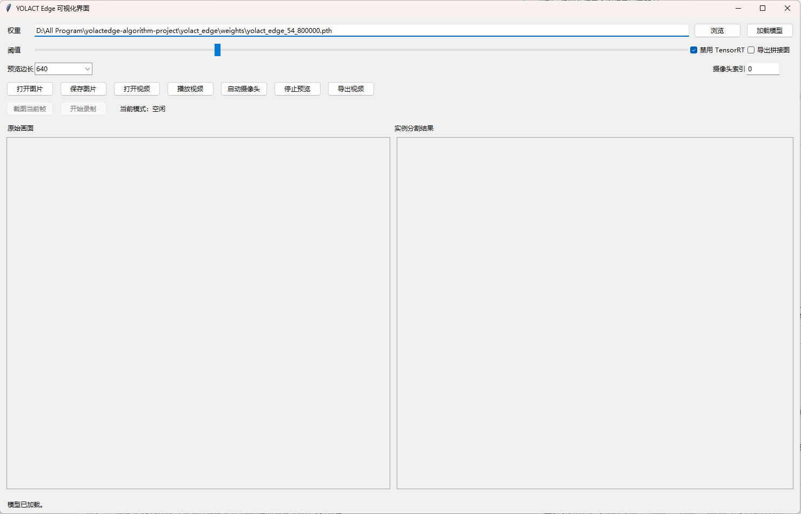
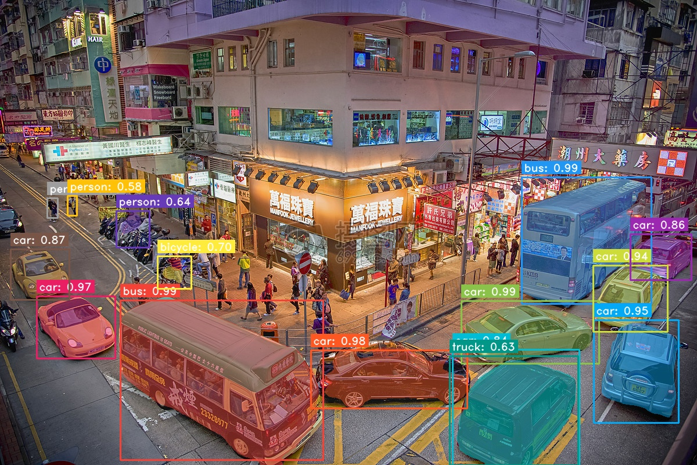
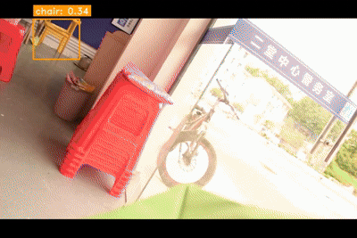
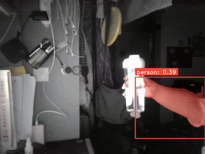

# YOLACT Edge Windows 本地实例分割演示项目

## 项目简介

这是一个基于 `YOLACT Edge` 的 Windows 本地实例分割演示项目。仓库在保留上游算法工程能力的基础上，补充了更适合本地展示与快速部署的可视化封装，包括统一推理后端、桌面 GUI、终端交互入口，以及图片、视频、摄像头场景下的结果导出能力。

如果你的目标是快速完成以下任务，这个仓库更合适直接使用：

- 加载现成权重完成单图实例分割
- 对本地视频进行预览和导出
- 调用电脑摄像头进行实时分割演示
- 在 Windows 环境下验证 `YOLACT Edge` 推理链路

当前仓库的重点是“本地推理演示与应用封装”，不是只保留原始论文代码，也不是面向训练细节展开的纯算法仓。

## 项目演示

推荐将 [terminal/gui_app.py](./terminal/gui_app.py) 作为主演示入口，完整流程如下：

`加载权重 -> 打开图片 / 视频 -> 实时预览分割结果 -> 截图 / 录制 / 导出`

### 演示入口

- GUI 演示入口：[`terminal/run_gui.bat`](./terminal/run_gui.bat)
- 终端演示入口：[`terminal/visual_terminal.py`](./terminal/visual_terminal.py)
- 原生算法入口：[`yolact_edge/eval.py`](./yolact_edge/eval.py)

### 展示素材

#### GUI 主界面展示



#### 单图分割效果

| 原图 | 分割结果 |
| --- | --- |
|  |  |

#### 视频分割效果



#### 摄像头实时效果



补充说明：

- 上游仓库自带官方 GIF 示例，可参考:

`yolact_edge/data/yolact_edge_example_1.gif`、`yolact_edge/data/yolact_edge_example_2.gif`、`yolact_edge/data/yolact_edge_example_3.gif`

## 核心功能

- 模型权重加载：支持加载 `yolact_edge/weights/` 下的 `.pth` 权重文件
- 单图实例分割：支持对 `.jpg`、`.png`、`.bmp`、`.webp` 等图片进行分割
- 视频预览推理：支持本地视频文件的逐帧预览
- 视频结果导出：支持导出分割结果视频，或导出原图与结果拼接视频
- 摄像头实时识别：支持通过摄像头索引调用本机摄像头进行实时推理
- 截图与录制：支持在 GUI 预览过程中截图当前帧并录制实时结果
- 命令行推理：支持通过终端脚本快速完成图片、视频、摄像头推理

## 技术栈说明

项目由“深度学习推理层 + Windows 本地可视化层”两部分组成。

### 算法与推理

- `YOLACT Edge`
- `PyTorch 1.8.1+cu111`
- `TorchVision 0.9.1+cu111`
- `CUDA`
- 可选 `TensorRT`

### 图像处理与桌面交互

- `OpenCV`
- `Pillow`
- `Tkinter`
- `NumPy`

### 扩展与数据工具

- `Cython`
- `pycocotools`
- `YTVOS` 相关支持

当前仓库默认更推荐先使用纯 PyTorch 推理链路完成部署验证，即首次运行优先加上 `--disable_tensorrt`，确认模型加载、图片推理、视频预览和结果导出均正常后，再考虑 TensorRT 优化。

## 项目目录结构

```text
yolactedge-algorithm-project/
├─ README.md
├─ cocoapi/                    # pycocotools 与 YTVOS 相关源码
├─ terminal/                   # 本仓库新增的本地可视化与终端封装
│  ├─ gui_app.py               # GUI 主程序
│  ├─ inference_backend.py     # 统一推理后端
│  ├─ visual_terminal.py       # 终端可视化入口
│  ├─ run_gui.bat              # Windows 一键启动 GUI
│  └─ outputs/                 # 截图、录制、导出结果目录
└─ yolact_edge/                # 上游 YOLACT Edge 主工程
   ├─ eval.py                  # 原生推理 / 评估入口
   ├─ train.py                 # 训练入口
   ├─ setup.py                 # 包安装与 cython_nms 编译入口
   ├─ weights/                 # 模型权重目录
   ├─ data/                    # 配置、样例资源、脚本
   └─ yolact_edge/             # 核心模型源码
```

## 环境依赖

### 推荐环境

- Windows 10 / 11
- Python `3.8`
- NVIDIA CUDA GPU
- Visual Studio C++ 编译工具链

### 已验证环境

- Python `3.8.15`
- PyTorch `1.8.1+cu111`
- TorchVision `0.9.1+cu111`
- `CUDA` 可用
- GPU：`NVIDIA GeForce RTX 3050 Ti Laptop GPU`

### 主要依赖

- `torch`
- `torchvision`
- `opencv-python`
- `pillow`
- `numpy`
- `cython`
- `matplotlib`
- `GitPython`
- `termcolor`
- `tensorboard`
- `colorama`

说明：

- `pycocotools` 依赖已随仓库内 `cocoapi/` 提供源码
- `yolact_edge/setup.py` 已包含 `cython_nms` 所需的 `NumPy` 头文件路径处理
- 更详细的安装与排障请参考 [yolact_edge/INSTALL.md](./yolact_edge/INSTALL.md) 和 [yolact_edge/配置说明.md](./yolact_edge/%E9%85%8D%E7%BD%AE%E8%AF%B4%E6%98%8E.md)

## 快速运行

以下命令默认在仓库根目录执行。

### 1. 启动 GUI 演示

```powershell
cd .\terminal
.\run_gui.bat
```

或直接在根目录执行：

```powershell
& ".\yolact_edge\.venv38\Scripts\python.exe" .\terminal\gui_app.py
```

### 2. 终端模式运行

单图推理：

```powershell
& ".\yolact_edge\.venv38\Scripts\python.exe" .\terminal\visual_terminal.py --mode image --input .\yolact_edge\test.jpg --disable-tensorrt
```

视频推理：

```powershell
& ".\yolact_edge\.venv38\Scripts\python.exe" .\terminal\visual_terminal.py --mode video --input .\your_video.mp4 --disable-tensorrt --output .\terminal\outputs\result.mp4
```

摄像头推理：

```powershell
& ".\yolact_edge\.venv38\Scripts\python.exe" .\terminal\visual_terminal.py --mode camera --camera-index 0 --disable-tensorrt
```

### 3. 使用原生 `eval.py` 入口

单图推理：

```powershell
cd .\yolact_edge
..\yolact_edge\.venv38\Scripts\python.exe .\eval.py --disable_tensorrt --trained_model=weights\yolact_edge_54_800000.pth --score_threshold=0.3 --image=test.jpg
```

视频推理：

```powershell
cd .\yolact_edge
..\yolact_edge\.venv38\Scripts\python.exe .\eval.py --disable_tensorrt --trained_model=weights\yolact_edge_54_800000.pth --score_threshold=0.3 --video=input.mp4
```

摄像头推理：

```powershell
cd .\yolact_edge
..\yolact_edge\.venv38\Scripts\python.exe .\eval.py --disable_tensorrt --trained_model=weights\yolact_edge_54_800000.pth --score_threshold=0.3 --video=0
```

### 4. 权重准备

当前仓库中已存在以下权重文件：

- `yolact_edge/weights/yolact_edge_54_800000.pth`
- `yolact_edge/weights/yolact_edge_vid_847_50000.pth`

首次验证建议优先使用：

- `yolact_edge_54_800000.pth`
- `--disable_tensorrt`

### 5. Windows 路径注意事项

`eval.py` 的 `--image` 参数使用 `输入:输出` 形式表示源图与保存路径，例如：

```powershell
--image=input.jpg:output.jpg
```

因此在 Windows 下不要直接传入带盘符的绝对路径组合，例如：

```text
C:\input.jpg:D:\output.jpg
```

这会与程序内部的 `:` 分隔规则冲突。更推荐将文件放到项目目录中后使用相对路径。

## 算法原理简述

`YOLACT Edge` 是一个面向边缘设备和实时场景的实例分割方案，整体思路可以概括为：

1. 主干网络提取输入图像特征
2. FPN 融合多尺度特征，兼顾大目标与小目标检测
3. 检测头同时预测类别、边框和掩码系数
4. 原型掩码分支生成共享的 `mask prototype`
5. 通过掩码系数与原型特征组合，恢复每个实例的分割结果
6. 经过 NMS、阈值过滤和后处理，输出最终实例分割结果

与传统逐实例生成掩码的方式相比，这类“原型掩码 + 系数组合”的方法具有较好的实时性。`YOLACT Edge` 在此基础上进一步面向边缘推理场景进行优化，并提供 TensorRT 相关加速路径。

需要说明的是：本仓库的主要新增工作集中在 Windows 侧的推理封装、交互界面和结果导出流程，而不是改写 `YOLACT Edge` 核心模型结构。

## 系统效果与性能展示

### 效果展示

如展示素材。

#### GUI 主界面展示


#### 单图分割效果

| 原图 | 分割结果 |
| --- | --- |
|  |  |

#### 视频分割效果


#### 摄像头实时效果


### 性能展示

已确认的事实包括：

- 本地 CUDA 环境可用
- 已具备图片、视频、摄像头三类推理入口
- GUI 支持实时预览、截图、录制和导出

作为上游官方公开参考，`YOLACT Edge` 原始 README 中给出了论文/官方环境下的 benchmark 信息，例如：

- 在 Jetson AGX Xavier 上，官方说明最高可达约 `30.8 FPS`
- 在 RTX 2080 Ti 上，官方说明最高可达约 `172.7 FPS`

这些数字来自上游仓库和论文环境，用于说明算法定位，不代表当前这台 Windows 设备的实际测得性能。

后续进行本机测试，得出如下表格：

| 测试场景 | 分辨率 | 设备  | FPS / 耗时 |
| --- | --- | --- | --- |
| 单图推理 | 1200*801 | 本机 | 12s |
| 视频预览 | 720*480 | 本机 | 4.8~7.4 |
| 摄像头实时 | 640*480 | 本机 | 5.66 |
| 视频导出 | 640*480 | 本机 | 5.66 |

## 常见问题

### 1. 权重加载失败

优先检查以下几项：

- 权重路径是否存在
- 是否使用了与权重匹配的配置
- 虚拟环境依赖是否安装完整
- 首次运行是否已加上 `--disable_tensorrt`

### 2. `cl` 命令不可用

这通常说明当前 PowerShell 没有加载 Visual Studio C++ 编译环境。由于 `pycocotools` 和 `cython_nms` 需要本地编译，Windows 下必须确保 `cl` 可用。

### 3. `numpy/arrayobject.h` 找不到

这通常发生在编译扩展时未正确找到 NumPy 头文件。当前仓库中的 [`yolact_edge/setup.py`](./yolact_edge/setup.py) 已补充 `np.get_include()`，如果仍然报错，优先检查虚拟环境中的 `numpy` 是否已正确安装。

### 4. `pycocotools` 安装报编译参数错误

Windows + MSVC 环境下，GCC/Clang 风格参数可能导致编译失败。当前仓库内 [`cocoapi/PythonAPI/setup.py`](./cocoapi/PythonAPI/setup.py) 已将 `extra_compile_args` 处理为兼容 Windows 的形式。

### 5. TensorRT 相关报错

如果你当前目标只是先把项目跑通，建议优先关闭 TensorRT：

```powershell
--disable_tensorrt
```

当前仓库的推荐路径是先验证 PyTorch 推理链路，再考虑 TensorRT 优化。

### 6. 视频预览较慢

可优先尝试以下方法：

- 在 GUI 中将“预览边长”先设置为 `480` 或 `640`
- 首次调试先关闭 TensorRT 之外的额外优化尝试
- 确认当前推理设备实际使用的是 GPU 而不是 CPU

### 7. 视频导出较慢

这是正常现象。导出流程本质上是完整逐帧推理并编码写盘，通常会慢于实时预览。

### 8. 摄像头打不开

优先检查摄像头索引：

- 主摄像头通常是 `0`
- 外接摄像头可能是 `1`
- 采集卡等设备可能是 `2` 或更高

## 项目总结与说明

这个仓库适合以下场景：

- 课程设计或毕业设计中的实例分割演示
- Windows 本地部署验证
- 算法效果展示与答辩演示
- 基于 `YOLACT Edge` 的二次开发起点

它的优势不只是“能跑通模型”，而是已经把本地演示中最常用的链路打通了：

- GUI 交互更适合展示
- 终端脚本更适合调试
- 原生 `eval.py` 仍保留，方便继续深入算法工程

如果你后续要继续做训练、评估、数据集扩展或 TensorRT 深度优化，建议进一步阅读以下文档：

- [yolact_edge/README.md](./yolact_edge/README.md)
- [yolact_edge/README_CN.md](./yolact_edge/README_CN.md)
- [yolact_edge/INSTALL.md](./yolact_edge/INSTALL.md)
- [yolact_edge/配置说明.md](./yolact_edge/%E9%85%8D%E7%BD%AE%E8%AF%B4%E6%98%8E.md)

## 版权与致谢

本仓库的核心算法能力来源于上游 `YOLACT` / `YOLACT Edge` 项目，相关模型结构、训练评估流程与论文成果归原作者团队所有。

- 上游算法工程：`WisconsinAIVision / yolact_edge`
- 实例分割基础工作：`YOLACT`
- 边缘端实时实例分割扩展：`YOLACT Edge`
- 数据工具支持：`cocoapi` 与 `YTVOS` 相关实现

许可协议请参考：

- [yolact_edge/LICENSE](./yolact_edge/LICENSE)

感谢上游作者公开论文、代码与模型，也感谢相关开源社区在 `pycocotools`、`YTVOS`、`PyTorch` 和 `OpenCV` 生态中的支持。

本仓库在此基础上新增和整理的内容，主要包括：

- Windows 环境下的部署适配
- 本地 GUI 与终端可视化封装
- 统一推理后端
- 更适合演示和快速上手的运行入口与说明文档
